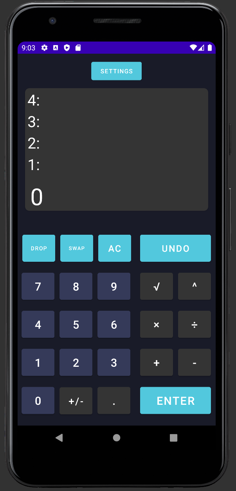

# RPN Calculator

## General
This is a project for Ubiquitous Computing classes, where we had to create a simple calculator application running on android device. Even though a calculator is a simple project, the catch was that it had to work based on <a href="https://en.wikipedia.org/wiki/Reverse_Polish_notation" target="_blank">Reverse Polish Notation</a>. 

To simplify the idea of this notation. Operators must follow their operands. For example if we were to add two numbers, we would need to add them firstly on stack by typing them in and follow it with clicking a operation, which in our example is "+". Four newest elements of the stack are shown above typing field so that we could easily see on which numbers we will do operation.

Because of the fact that in RPN we have stack, we also have operation buttons directly for stack itself.
* DROP button - deletes the newest element on the stack
* SWAP button - switches two newest elements on the stack
* UNDO button - undoes the latest operation

Besides the calculator, there are also settings that allow user to change rounding digit of calculation and to change the color of the stack background by giving color value in hexadecimal.

## UI

## Technologies

| Name | 
| ------ | 
| Kotlin | 
| Android Studio | 

